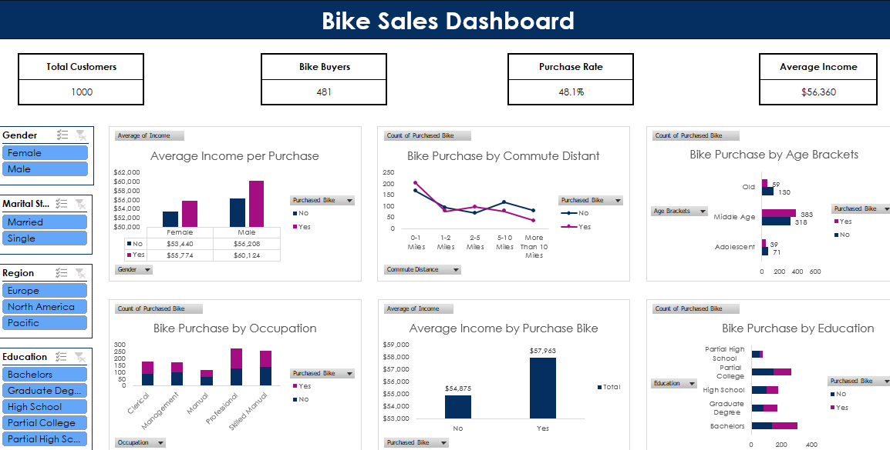

# Bike Sales Customer Behavior Analysis with Excel Dashboard
This project analyzes bike sales data using Microsoft Excel to uncover customer purchasing behavior. The data was cleaned, transformed, and analyzed using pivot tables, then visualized through an interactive dashboard. This project highlights how Excel can be used to turn raw data into actionable business insights for better decision-making.

 

## 1. Backround
Dalam dunia bisnis yang kompetitif, memahami perilaku pelanggan menjadi kunci penting dalam meningkatkan penjualan dan menyusun strategi pemasaran yang efektif. Perusahaan perlu mengetahui faktor-faktor apa saja yang memengaruhi keputusan pelanggan dalam membeli suatu produk, termasuk karakteristik demografis, kondisi finansial, serta kebiasaan sehari-hari.

Dataset penjualan sepeda yang digunakan dalam proyek ini menyediakan informasi terkait profil pelanggan seperti usia, jenis kelamin, pendapatan, tingkat pendidikan, pekerjaan, serta jarak perjalanan harian (commute distance). Data ini memiliki potensi untuk dianalisis lebih lanjut guna mengidentifikasi pola pembelian dan segmentasi pelanggan.

## 3. Tujuan
Tujuan dari proyek ini adalah:

- Menganalisis perilaku pelanggan dalam pembelian sepeda berdasarkan data demografis dan finansial
- Mengidentifikasi faktor-faktor yang memengaruhi keputusan pembelian pelanggan
- Melakukan segmentasi pelanggan berdasarkan karakteristik seperti usia, pendapatan, dan jarak perjalanan
- Menyajikan hasil analisis dalam bentuk dashboard yang mudah dipahami
- Menghasilkan insight yang dapat mendukung strategi pemasaran dan pengambilan keputusan bisnis

## 4. Dataset
Dataset yang digunakan dalam proyek ini merupakan data penjualan sepeda yang berisi informasi terkait profil demografis, kondisi finansial, dan perilaku pelanggan.

Jumlah data: ±1.000 baris

Fitur dalam dataset meliputi:

- ID: Identitas unik setiap pelanggan
- Marital Status: Status pernikahan (Married/Single)
- Gender: Jenis kelamin pelanggan (Female/Male)
- Income: Pendapatan tahunan pelanggan
- Children: Jumlah anak
- Education: Tingkat pendidikan
- Occupation: Pekerjaan pelanggan
- Home Owner: Status kepemilikan rumah (Yes/No)
- Cars: Jumlah kendaraan yang dimiliki
- Commute Distance: Jarak perjalanan harian pelanggan
- Region: Wilayah tempat tinggal pelanggan
- Age: Usia pelanggan
- Purchased Bike: Status pembelian sepeda (Yes/No)

## 5. Data Cleaning & Preprocessing
Pada tahap ini, dilakukan proses pembersihan dan persiapan data untuk memastikan data siap dianalisis dan menghasilkan insight yang akurat.

Beberapa langkah yang dilakukan meliputi:

1. Data Cleaning:

Memeriksa dan memastikan tidak terdapat missing values atau data duplikat yang dapat memengaruhi hasil analisis.

2. Standarisasi Data:

Mengubah format data agar lebih konsisten dan mudah dipahami, seperti:
  - Mengubah kode kategori pada fitur Marital status dari M/S menjadi format lengkap Married/Single
  - Mengubah kode kategori pada fitur gender dari F/M menjadi format lengkap Female/Male
  - Menyederhanakan format pada kolom Commute Distance agar lebih terstruktur
  
3. Data Transformation:

Melakukan penyesuaian tipe data dan format, seperti memastikan kolom numerik (Income, Age, Cars) dalam format angka yang sesuai.

5. Feature Engineering:

Membuat fitur baru untuk mempermudah analisis, seperti:
  - Mengelompokkan usia ke dalam kategori (Age Brackets) untuk segmentasi pelanggan

6. Data Validation:

Melakukan pengecekan ulang untuk memastikan data sudah konsisten, bersih, dan siap digunakan dalam proses analisis dan pembuatan dashboard.

Proses ini penting untuk meningkatkan kualitas data sehingga hasil analisis menjadi lebih valid dan dapat diandalkan dalam mendukung pengambilan keputusan bisnis.

## 6. Key Insight
Berdasarkan hasil analisis dan visualisasi pada dashboard, diperoleh beberapa insight utama terkait perilaku pelanggan dalam pembelian sepeda:

### 1. Tingkat Pembelian Sepeda Masih Berada di Bawah 50%

Dari total 1.000 pelanggan, sebanyak 481 pelanggan (48,1%) melakukan pembelian sepeda, sedangkan 519 pelanggan (51,9%) tidak melakukan pembelian.

Insight ini menunjukkan bahwa tingkat konversi pembelian masih relatif rendah dan perusahaan masih memiliki peluang besar untuk meningkatkan penjualan dengan menargetkan pelanggan yang belum melakukan pembelian.

### 2. Pendapatan Berpengaruh Terhadap Keputusan Pembelian

Hasil analisis menunjukkan bahwa pelanggan yang membeli sepeda memiliki rata-rata pendapatan sebesar $57.963, sedangkan pelanggan yang tidak membeli memiliki rata-rata pendapatan sebesar $54.875.

Hal ini mengindikasikan bahwa pelanggan dengan tingkat pendapatan yang lebih tinggi cenderung memiliki kemungkinan lebih besar untuk membeli sepeda dibandingkan pelanggan dengan pendapatan yang lebih rendah.

### 3. Kelompok Usia Middle Age Merupakan Segmen Pembeli Terbesar

Berdasarkan analisis Age Brackets, kelompok usia Middle Age (31–54 tahun) memiliki jumlah pembeli tertinggi dengan total 383 pelanggan, jauh lebih tinggi dibandingkan kelompok Adolescent maupun Old.

Hal ini menunjukkan bahwa pelanggan usia produktif merupakan target pasar utama bagi produk sepeda karena memiliki kebutuhan mobilitas yang tinggi serta kemampuan finansial yang lebih baik.

### 4. Jarak Perjalanan Pendek Mendominasi Pembelian Sepeda

Kelompok pelanggan dengan jarak perjalanan 0–1 Miles mencatat jumlah pembelian tertinggi, yaitu sebanyak 200 pelanggan.

Sementara itu, jumlah pembelian cenderung menurun seiring bertambahnya jarak perjalanan pelanggan. Hal ini menunjukkan bahwa sepeda lebih banyak digunakan sebagai sarana transportasi untuk perjalanan jarak pendek dibandingkan perjalanan jarak jauh.

### 5. Segmen Professional Menjadi Penyumbang Pembelian Terbesar

Berdasarkan kategori pekerjaan, pelanggan dengan profesi Professional memiliki jumlah pembelian tertinggi, yaitu sebanyak 150 pelanggan, diikuti oleh kelompok Skilled Manual dengan 115 pelanggan.

Temuan ini menunjukkan bahwa kelompok profesional memiliki minat yang lebih tinggi terhadap penggunaan sepeda, baik untuk kebutuhan transportasi maupun gaya hidup sehat.

### 6. Pelanggan dengan Pendidikan Sarjana Lebih Banyak Membeli Sepeda

Hasil analisis tingkat pendidikan menunjukkan bahwa pelanggan dengan pendidikan Bachelor's Degree memiliki jumlah pembelian tertinggi, yaitu sebanyak 169 pelanggan.

Hal ini mengindikasikan bahwa pelanggan dengan tingkat pendidikan yang lebih tinggi cenderung memiliki kesadaran yang lebih baik terhadap manfaat kesehatan, lingkungan, dan mobilitas yang ditawarkan oleh penggunaan sepeda.

## 7. Business Recomendation
Berdasarkan insight yang diperoleh dari analisis data, berikut beberapa rekomendasi yang dapat diterapkan untuk meningkatkan penjualan sepeda:

### 1. Memfokuskan Strategi Pemasaran pada Kelompok Usia Middle Age

Karena kelompok usia Middle Age merupakan segmen dengan jumlah pembeli terbesar, perusahaan dapat mengembangkan kampanye pemasaran yang secara khusus menargetkan pelanggan berusia 31–54 tahun.

Strategi yang dapat diterapkan antara lain:

- Promosi produk untuk kebutuhan commuting harian.
- Kampanye digital yang menyasar usia produktif.
- Program loyalitas bagi pelanggan aktif.

### 2. Menargetkan Pelanggan Berpendapatan Menengah ke Atas

Karena pelanggan dengan pendapatan lebih tinggi memiliki kecenderungan lebih besar untuk membeli sepeda, perusahaan dapat mengembangkan strategi pemasaran yang berfokus pada segmen ini.

Beberapa strategi yang dapat dilakukan:

- Menawarkan produk premium dengan fitur tambahan.
- Menyediakan program cicilan atau pembayaran bertahap.
- Menawarkan paket bundling aksesoris dan perlengkapan sepeda.

### 3. Mengembangkan Program Khusus untuk Segmen Profesional

Kelompok Professional merupakan segmen pekerjaan dengan jumlah pembelian tertinggi. Oleh karena itu, perusahaan dapat membuat program pemasaran yang lebih spesifik untuk kelompok ini.

Contoh strategi:

- Program "Bike to Work".
- Kerja sama dengan perusahaan atau perkantoran.
- Diskon khusus untuk karyawan perusahaan tertentu.

### 4. Memperkuat Promosi Sepeda sebagai Transportasi Jarak Pendek

Karena mayoritas pembeli berasal dari kelompok dengan jarak perjalanan 0–1 Miles, perusahaan dapat memposisikan sepeda sebagai solusi transportasi harian yang efisien dan ekonomis.

Strategi yang dapat dilakukan:

- Menonjolkan manfaat kesehatan dan penghematan biaya transportasi.
- Memasarkan produk city bike atau commuter bike.
- Membuat kampanye ramah lingkungan untuk penggunaan sepeda sehari-hari.

### 5. Meningkatkan Konversi Pelanggan yang Belum Membeli

Masih terdapat 519 pelanggan yang belum melakukan pembelian sepeda. Kelompok ini merupakan peluang potensial untuk meningkatkan penjualan.

Strategi yang dapat diterapkan:

- Memberikan diskon pembelian pertama.
- Menawarkan program referral pelanggan.
- Melakukan remarketing kepada pelanggan yang belum membeli.
- Menyediakan promo musiman atau cashback.
